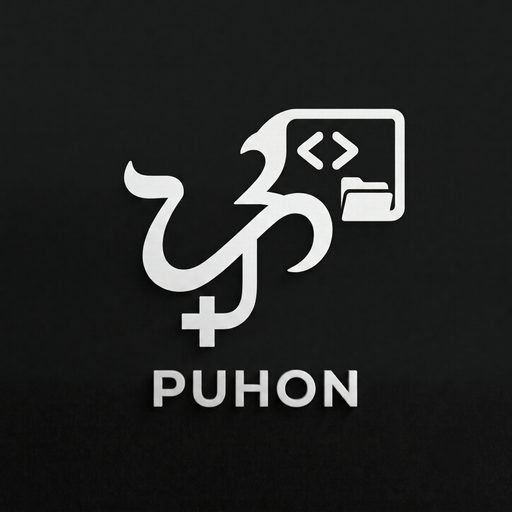

<div align="center">
  
  <h1>Terax</h1>

  <p><strong>A terminal workspace for coding-agent CLIs.</strong></p>
</div>

---

Lightweight terminal workspace built on Tauri 2 + Rust and React 19, designed to host the coding-agent CLIs you already use (Codex, OpenCode, Pi, Claude Code) alongside a file explorer, web preview, source control, and editor, so you stay in one app. Native PTY backend with WebGL renderer. No telemetry, no accounts, no built-in AI.

## Features

### Terminal

- xterm.js with WebGL renderer, multi-tab with background streaming
- Native PTY backend via `portable-pty` (zsh, bash, pwsh, fish, cmd)
- Split panels (horizontal and vertical)
- Block-based command input with shell integration (OSC 133)
- Inline search, link detection, true-color
- WSL workspace support on Windows

### Editor

- CodeMirror 6 with syntax highlighting for TS/JS, Rust, Python, Go, C/C++, Java, HTML/CSS, JSON, Markdown, and more
- Vim mode
- External formatter support (prettier, biome, ruff, rustfmt, gofmt, clang-format, shfmt, zig fmt)
- Built-in editor themes

### Source Control

- Stage / unstage hunks, commit, push
- Git history panel with commit graph
- Commit search and per-file diffs

### File Explorer

- File tree with icon theme
- Fuzzy search, keyboard navigation, inline rename, context actions

### Themes

- Built-in preset themes (kanagawa, catppuccin, tokyo-night, nord, gruvbox, dracula, everforest, rose-pine, solarized, and more)
- Custom theme builder
- Background images with adjustable opacity and blur
- Editor theme independent from app theme

## Install

Releases currently ship Linux binaries (AppImage, .deb, .rpm). macOS and Windows build and run from source but are not in the release pipeline yet.

Download Linux builds from [Releases](https://github.com/kevsmir02/terax-ai/releases/latest).

### Windows

- On first launch Windows may show "Windows protected your PC". Click **More info** then **Run anyway**.
- Default shell: `pwsh.exe` → `powershell.exe` → `cmd.exe`.

### Linux

- **.deb** (Debian, Ubuntu, Mint) and **.rpm** (Fedora, RHEL, openSUSE): download from [Releases](https://github.com/kevsmir02/terax-ai/releases/latest).
- **AppImage:** needs FUSE. Without it: `./Terax_*.AppImage --appimage-extract-and-run`. On Wayland with rendering issues, try `WEBKIT_DISABLE_DMABUF_RENDERER=1`.

AUR and Nix are not supported install paths for this fork.

## Build from source

**Prerequisites:** Rust (stable), Node 20+, pnpm, [Tauri prerequisites](https://tauri.app/start/prerequisites/)

```bash
pnpm install
pnpm tauri dev          # development
pnpm tauri build        # production bundle
```

**Checks:**

```bash
pnpm lint && pnpm check-types && pnpm test
cd src-tauri && cargo clippy --all-targets --locked -- -D warnings
cd src-tauri && cargo test --locked
```

## License

Apache 2.0. See [LICENSE](LICENSE).
